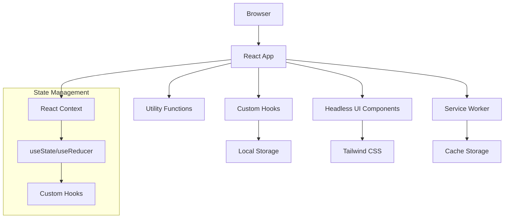
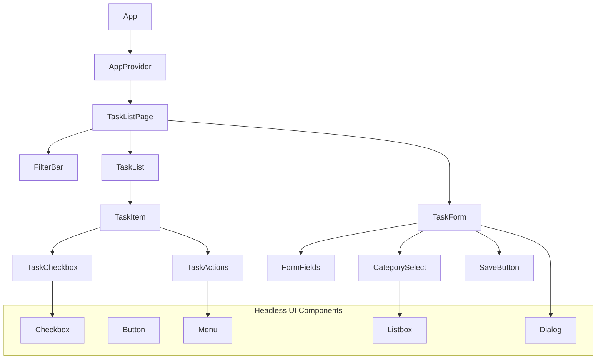
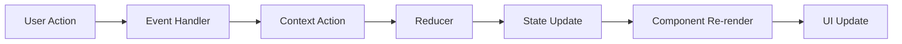

# Architecture Overview

This document provides a comprehensive overview of the Headless UI Todo App's architecture, including design decisions, patterns, and implementation details that make the application maintainable, scalable, and accessible.

## 🏗️ High-Level Architecture

### System Overview

The application follows a modern React architecture with emphasis on accessibility, performance, and maintainability:



### Core Principles

#### 1. **Accessibility First**
Every component is built with accessibility as a primary concern, leveraging Headless UI's accessible primitives and following WCAG 2.1 AA guidelines.

#### 2. **Component-Driven Development**
The application is composed of small, reusable components that are easy to test, maintain, and reason about.

#### 3. **Performance Optimization**
Optimized for both initial load time and runtime performance with efficient rendering and minimal re-renders.

#### 4. **Type Safety**
Full TypeScript coverage ensures compile-time error catching and excellent developer experience.

## 📁 Project Structure

### Directory Organization

```
src/
├── components/          # React components
│   ├── ui/             # Reusable UI components
│   ├── forms/          # Form-specific components
│   ├── layout/         # Layout components
│   └── features/       # Feature-specific components
├── hooks/              # Custom React hooks
├── utils/              # Utility functions
├── types/              # TypeScript type definitions
├── contexts/           # React contexts
├── constants/          # Application constants
├── assets/             # Static assets
└── test/               # Test utilities and mocks
```

### Component Hierarchy



## 🧩 Core Components

### App Component

**Purpose**: Root application component that provides global context and routing logic.

```typescript
// src/App.tsx
function App() {
  return (
    <TaskProvider>
      <FilterProvider>
        <KeyboardShortcutProvider>
          <div className="min-h-screen bg-gray-50">
            <Header />
            <main className="container mx-auto px-4 py-8">
              <TaskListPage />
            </main>
          </div>
        </KeyboardShortcutProvider>
      </FilterProvider>
    </TaskProvider>
  )
}
```

**Key Responsibilities**:
- Context provider setup
- Global layout structure
- Error boundary implementation
- PWA service worker registration

### TaskProvider Context

**Purpose**: Central state management for task-related operations.

```typescript
// src/contexts/TaskContext.tsx
interface TaskContextType {
  tasks: Task[]
  addTask: (task: Omit<Task, 'id' | 'createdAt'>) => void
  updateTask: (id: string, updates: Partial<Task>) => void
  deleteTask: (id: string) => void
  toggleComplete: (id: string) => void
  clearCompleted: () => void
  isLoading: boolean
  error: string | null
}
```

**Architecture Pattern**: Uses `useReducer` for complex state updates with actions:

```typescript
type TaskAction = 
  | { type: 'ADD_TASK'; payload: Task }
  | { type: 'UPDATE_TASK'; payload: { id: string; updates: Partial<Task> } }
  | { type: 'DELETE_TASK'; payload: string }
  | { type: 'TOGGLE_COMPLETE'; payload: string }
  | { type: 'CLEAR_COMPLETED' }
  | { type: 'SET_LOADING'; payload: boolean }
  | { type: 'SET_ERROR'; payload: string | null }
```

## 🎣 Custom Hooks Architecture

### Hook Categories

#### 1. **Data Hooks**
- `useTasks`: Task CRUD operations
- `useLocalStorage`: Persistent storage management
- `useFilters`: Filter state management

#### 2. **UI Hooks**
- `useKeyboardShortcuts`: Global keyboard handling
- `useFocusManagement`: Accessibility focus control
- `useToast`: User notifications

#### 3. **Utility Hooks**
- `useDebounce`: Input debouncing
- `useEventListener`: Event management
- `useOnlineStatus`: Network status detection

### Example: useTasks Hook

```typescript
// src/hooks/useTasks.ts
export function useTasks() {
  const [state, dispatch] = useReducer(taskReducer, initialState)
  const { saveToStorage } = useLocalStorage('tasks')
  
  const addTask = useCallback((taskData: Omit<Task, 'id' | 'createdAt'>) => {
    const newTask: Task = {
      ...taskData,
      id: generateId(),
      createdAt: new Date(),
      updatedAt: new Date(),
    }
    
    dispatch({ type: 'ADD_TASK', payload: newTask })
    saveToStorage(state.tasks.concat(newTask))
  }, [state.tasks, saveToStorage])
  
  // ... other operations
  
  return {
    tasks: state.tasks,
    addTask,
    updateTask,
    deleteTask,
    toggleComplete,
    clearCompleted,
    isLoading: state.isLoading,
    error: state.error,
  }
}
```

## 🎨 Styling Architecture

### Tailwind CSS Strategy

#### 1. **Utility-First Approach**
Components use Tailwind utilities directly for rapid development and consistent design:

```typescript
// Example component with Tailwind classes
function TaskItem({ task }: TaskItemProps) {
  return (
    <div className="flex items-center p-4 bg-white rounded-lg shadow-sm border border-gray-200 hover:shadow-md transition-shadow">
      <Checkbox className="mr-3" />
      <div className="flex-1 min-w-0">
        <h3 className="text-sm font-medium text-gray-900 truncate">
          {task.title}
        </h3>
      </div>
    </div>
  )
}
```

#### 2. **Component Variants**
Custom CSS classes for complex component states:

```css
/* src/styles/components.css */
.task-item {
  @apply flex items-center p-4 bg-white rounded-lg shadow-sm border border-gray-200;
  @apply hover:shadow-md transition-shadow;
}

.task-item--completed {
  @apply opacity-75;
}

.task-item--priority-high {
  @apply border-red-200 bg-red-50;
}
```

#### 3. **Custom Properties**
CSS custom properties for dynamic theming:

```css
:root {
  --color-primary: theme('colors.blue.600');
  --color-primary-hover: theme('colors.blue.700');
  --border-radius: theme('borderRadius.lg');
  --shadow-card: theme('boxShadow.sm');
}

[data-theme="dark"] {
  --color-primary: theme('colors.blue.400');
  --color-primary-hover: theme('colors.blue.300');
}
```

## 🧪 Testing Architecture

### Testing Strategy

#### 1. **Testing Pyramid**
- **70% Unit Tests**: Component and function testing
- **20% Integration Tests**: Component interaction testing
- **10% E2E Tests**: Complete user workflow testing

#### 2. **Testing Tools**
- **Jest**: Test runner and assertion library
- **React Testing Library**: Component testing utilities
- **Playwright**: End-to-end testing
- **MSW**: API mocking for tests

### Component Testing Pattern

```typescript
// src/components/__tests__/TaskItem.test.tsx
describe('TaskItem', () => {
  const mockTask: Task = {
    id: '1',
    title: 'Test Task',
    completed: false,
    category: 'work',
    createdAt: new Date(),
    updatedAt: new Date(),
  }

  const defaultProps = {
    task: mockTask,
    onToggleComplete: jest.fn(),
    onDelete: jest.fn(),
    onEdit: jest.fn(),
  }

  beforeEach(() => {
    jest.clearAllMocks()
  })

  test('renders task information correctly', () => {
    render(<TaskItem {...defaultProps} />)
    
    expect(screen.getByText('Test Task')).toBeInTheDocument()
    expect(screen.getByRole('checkbox')).not.toBeChecked()
  })

  test('calls onToggleComplete when checkbox is clicked', async () => {
    const user = userEvent.setup()
    render(<TaskItem {...defaultProps} />)
    
    await user.click(screen.getByRole('checkbox'))
    
    expect(defaultProps.onToggleComplete).toHaveBeenCalledWith('1')
  })
})
```

## 📦 State Management Patterns

### Context + Reducer Pattern

The application uses React Context with useReducer for global state management:

```typescript
// State structure
interface AppState {
  tasks: {
    items: Task[]
    loading: boolean
    error: string | null
  }
  filters: {
    status: FilterStatus
    category: TaskCategory | null
    searchTerm: string
  }
  ui: {
    isTaskFormOpen: boolean
    editingTaskId: string | null
    toasts: Toast[]
  }
}
```

### Local State Strategy

Components use local state for:
- Form inputs
- UI interactions (hover, focus)
- Temporary states (loading, error)

Global state is used for:
- Task data
- Application-wide settings
- Cross-component communication

## 🔌 Data Flow Architecture

### Unidirectional Data Flow



### Example: Adding a Task

1. **User Action**: User clicks "Add Task" button
2. **Event Handler**: `onClick` handler in Button component
3. **Context Action**: `addTask` function called with task data
4. **Reducer**: `ADD_TASK` action processed in taskReducer
5. **State Update**: New task added to state.tasks array
6. **Component Re-render**: TaskList component re-renders
7. **UI Update**: New task appears in the list

## 🚀 Performance Architecture

### Optimization Strategies

#### 1. **Memoization**
```typescript
// Memoize expensive calculations
const filteredTasks = useMemo(() => {
  return tasks.filter(task => {
    if (filters.status !== 'all' && task.completed !== (filters.status === 'completed')) {
      return false
    }
    if (filters.category && task.category !== filters.category) {
      return false
    }
    if (filters.searchTerm && !task.title.toLowerCase().includes(filters.searchTerm.toLowerCase())) {
      return false
    }
    return true
  })
}, [tasks, filters])

// Memoize callbacks to prevent unnecessary re-renders
const handleToggleComplete = useCallback((id: string) => {
  toggleComplete(id)
}, [toggleComplete])
```

#### 2. **Code Splitting**
```typescript
// Lazy load components
const TaskForm = lazy(() => import('./components/TaskForm'))
const SettingsPage = lazy(() => import('./pages/SettingsPage'))

// Use Suspense for loading states
<Suspense fallback={<LoadingSpinner />}>
  <TaskForm />
</Suspense>
```

#### 3. **Virtual Scrolling**
For large task lists, implement virtual scrolling:

```typescript
// src/components/VirtualTaskList.tsx
function VirtualTaskList({ tasks }: { tasks: Task[] }) {
  const [startIndex, setStartIndex] = useState(0)
  const [endIndex, setEndIndex] = useState(50)
  
  const visibleTasks = tasks.slice(startIndex, endIndex)
  
  return (
    <div className="virtual-list" onScroll={handleScroll}>
      {visibleTasks.map(task => (
        <TaskItem key={task.id} task={task} />
      ))}
    </div>
  )
}
```

## 🔐 Security Architecture

### Client-Side Security

#### 1. **Input Sanitization**
```typescript
// src/utils/sanitize.ts
export function sanitizeInput(input: string): string {
  return input
    .replace(/[<>]/g, '') // Remove potential HTML tags
    .trim()
    .slice(0, 1000) // Limit length
}
```

#### 2. **Content Security Policy**
```html
<!-- index.html -->
<meta http-equiv="Content-Security-Policy" content="
  default-src 'self';
  script-src 'self' 'unsafe-inline';
  style-src 'self' 'unsafe-inline';
  img-src 'self' data:;
  connect-src 'self';
">
```

#### 3. **Data Validation**
```typescript
// src/utils/validation.ts
const TaskSchema = z.object({
  title: z.string().min(1).max(200),
  description: z.string().max(1000).optional(),
  category: z.enum(['work', 'personal', 'shopping', 'health', 'other']),
  priority: z.enum(['low', 'medium', 'high']).optional(),
})

export function validateTask(data: unknown): Task {
  return TaskSchema.parse(data)
}
```

## 📱 PWA Architecture

### Service Worker Strategy

```typescript
// src/sw.ts
import { precacheAndRoute, cleanupOutdatedCaches } from 'workbox-precaching'
import { registerRoute } from 'workbox-routing'
import { CacheFirst, NetworkFirst } from 'workbox-strategies'

// Precache app shell
precacheAndRoute(self.__WB_MANIFEST)

// Cache API responses
registerRoute(
  ({ request }) => request.destination === 'document',
  new NetworkFirst({
    cacheName: 'pages',
    plugins: [{
      cacheKeyWillBeUsed: async ({ request }) => `${request.url}?version=1.0.0`
    }]
  })
)

// Cache static assets
registerRoute(
  ({ request }) => ['style', 'script', 'image'].includes(request.destination),
  new CacheFirst({
    cacheName: 'assets',
  })
)
```

### Offline-First Strategy

```typescript
// src/hooks/useOfflineSync.ts
export function useOfflineSync() {
  const [isOnline, setIsOnline] = useState(navigator.onLine)
  const [pendingActions, setPendingActions] = useState<Action[]>([])
  
  useEffect(() => {
    const handleOnline = () => {
      setIsOnline(true)
      syncPendingActions()
    }
    
    const handleOffline = () => setIsOnline(false)
    
    window.addEventListener('online', handleOnline)
    window.addEventListener('offline', handleOffline)
    
    return () => {
      window.removeEventListener('online', handleOnline)
      window.removeEventListener('offline', handleOffline)
    }
  }, [])
  
  const syncPendingActions = async () => {
    // Sync logic when coming back online
  }
}
```

## 🔍 Error Handling Architecture

### Error Boundary Pattern

```typescript
// src/components/ErrorBoundary.tsx
class ErrorBoundary extends Component<ErrorBoundaryProps, ErrorBoundaryState> {
  constructor(props: ErrorBoundaryProps) {
    super(props)
    this.state = { hasError: false, error: null }
  }
  
  static getDerivedStateFromError(error: Error): ErrorBoundaryState {
    return { hasError: true, error }
  }
  
  componentDidCatch(error: Error, errorInfo: ErrorInfo) {
    console.error('Error caught by boundary:', error, errorInfo)
    // Send to error reporting service
  }
  
  render() {
    if (this.state.hasError) {
      return <ErrorFallback error={this.state.error} />
    }
    
    return this.props.children
  }
}
```

### Graceful Error Handling

```typescript
// src/hooks/useAsyncError.ts
export function useAsyncError() {
  const [error, setError] = useState<Error | null>(null)
  
  const throwError = useCallback((error: Error) => {
    setError(error)
  }, [])
  
  if (error) {
    throw error // Will be caught by Error Boundary
  }
  
  return throwError
}
```

## 📊 Monitoring and Analytics

### Performance Monitoring

```typescript
// src/utils/performance.ts
export function measurePerformance<T>(
  name: string,
  fn: () => T
): T {
  const start = performance.now()
  const result = fn()
  const end = performance.now()
  
  console.log(`${name} took ${end - start} milliseconds`)
  
  // Send to analytics service
  if ('gtag' in window) {
    window.gtag('event', 'timing_complete', {
      name,
      value: Math.round(end - start),
    })
  }
  
  return result
}
```

### User Analytics (Privacy-Focused)

```typescript
// src/utils/analytics.ts
export function trackUserAction(action: string, data?: Record<string, any>) {
  // Only track aggregated, anonymized data
  const event = {
    action,
    timestamp: Date.now(),
    data: data ? sanitizeAnalyticsData(data) : undefined,
  }
  
  // Store locally for privacy
  const events = getLocalAnalytics()
  events.push(event)
  setLocalAnalytics(events.slice(-1000)) // Keep last 1000 events
}
```

## 🔄 Future Architecture Considerations

### Scalability Patterns

#### 1. **Micro-frontend Architecture**
For larger applications, consider splitting into micro-frontends:
- Task management module
- Settings module  
- Analytics module
- User management module

#### 2. **Backend Integration**
When adding server-side functionality:
- GraphQL for flexible data fetching
- Real-time subscriptions for collaboration
- Optimistic updates for better UX

#### 3. **Enhanced Performance**
- Web Workers for heavy computations
- IndexedDB for large datasets
- Server-side rendering for SEO

---

## 📚 Next Steps

Now that you understand the architecture:

1. **[Explore Components](components.md)** - Deep dive into component implementation
2. **[Study Hooks](hooks.md)** - Learn about custom hook patterns
3. **[Review Testing](testing.md)** - Understand the testing strategy
4. **[Build Process](building.md)** - Learn about the build and deployment pipeline

The architecture is designed to be maintainable, scalable, and accessible. Each decision prioritizes code quality, performance, and user experience. 🚀
