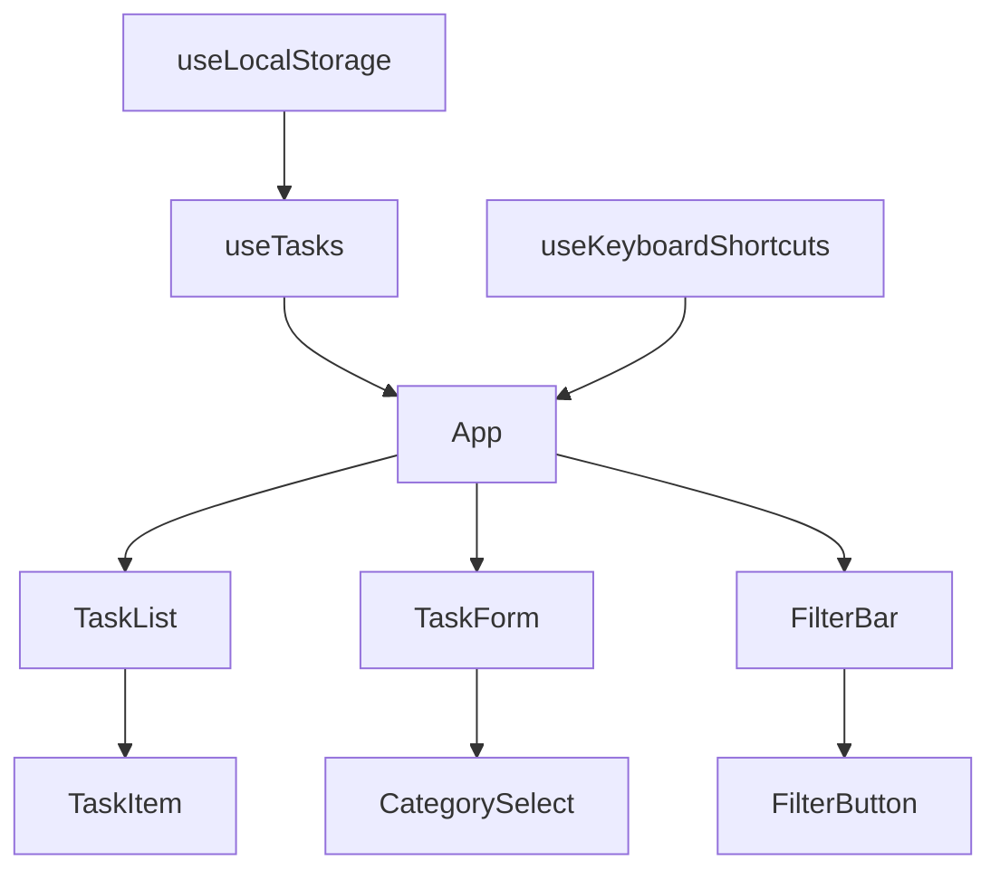

# Overview

The **Headless UI Todo App** is a comprehensive task management application that demonstrates best practices for building accessible, performant, and maintainable React applications.

## 🎯 Project Goals

### Primary Objectives

- **Accessibility Excellence**: Demonstrate how to build fully accessible applications using Headless UI components
- **Modern React Patterns**: Showcase current best practices in React development with TypeScript
- **Spec-Driven Development**: Provide a real-world example of specification-driven development methodology
- **Production Readiness**: Include all aspects needed for a production application

### Target Audience

- **React Developers** learning about accessibility and Headless UI
- **Teams** looking for accessible component patterns
- **Organizations** implementing spec-driven development
- **Students** studying modern web development practices

## 🏗️ Architecture Philosophy

### Component-Driven Design

The application follows a strict component-driven architecture where each piece of functionality is encapsulated in reusable, testable components.

### Accessibility-First Approach

Every component is built with accessibility as a primary concern:

- **Semantic HTML**: Proper heading hierarchy and landmark regions
- **ARIA Labels**: Comprehensive labeling for screen readers
- **Keyboard Navigation**: Full keyboard accessibility
- **Focus Management**: Logical focus flow and visual indicators

### Progressive Enhancement

The application works without JavaScript and progressively enhances the experience:

1. **Base Layer**: Core HTML and CSS
2. **Enhancement Layer**: JavaScript interactions
3. **Advanced Layer**: PWA features and offline support

## 🎨 Design Principles

### Simplicity

Clean, uncluttered interface that focuses on task management without distractions.

### Consistency

Consistent interaction patterns and visual design throughout the application.

### Performance

Optimized for speed with lazy loading, efficient rendering, and minimal bundle size.

### Flexibility

Extensible architecture that allows for easy addition of new features.

## 🔧 Key Technologies

### Core Stack

| Technology | Version | Purpose |
|------------|---------|---------|
| **React** | 18+ | UI Framework |
| **TypeScript** | 5+ | Type Safety |
| **Headless UI** | 2.0+ | Accessible Components |
| **Tailwind CSS** | 3.4+ | Styling |
| **Vite** | 5+ | Build Tool |

### Testing & Quality

| Tool | Purpose |
|------|---------|
| **Jest** | Unit Testing |
| **React Testing Library** | Component Testing |
| **Playwright** | End-to-End Testing |
| **ESLint** | Code Linting |
| **Prettier** | Code Formatting |

### PWA & Performance

| Feature | Implementation |
|---------|----------------|
| **Service Worker** | Workbox |
| **Offline Storage** | localStorage + IndexedDB |
| **Performance Monitoring** | Web Vitals |
| **Bundle Analysis** | Vite Bundle Analyzer |

## 📋 Feature Overview

### Core Features

- ✅ **Task Management**: Create, edit, delete, and complete tasks
- 🏷️ **Categorization**: Organize tasks by category (Work, Personal, etc.)
- 🔍 **Filtering**: Filter tasks by status and category
- 💾 **Persistence**: Automatic saving to local storage
- ⚡ **Real-time Updates**: Immediate UI updates for all actions

### Advanced Features

- 📱 **PWA Support**: Install as native app, offline functionality
- ♿ **Full Accessibility**: WCAG 2.1 AA compliance
- ⌨️ **Keyboard Shortcuts**: Complete keyboard navigation
- 🎨 **Responsive Design**: Mobile-first, works on all devices
- 🔄 **State Management**: Efficient state updates with React hooks

### Developer Features

- 🧪 **Comprehensive Testing**: 90%+ test coverage
- 📚 **Full Documentation**: Complete API and user documentation
- 🔧 **Developer Tools**: Hot reload, TypeScript support
- 📦 **Easy Deployment**: Multiple deployment options
- 🚀 **CI/CD Ready**: Automated testing and deployment

## 🚀 Getting Started

Ready to dive in? Continue to the [Quick Start Guide](quick-start.md) to set up the project in under 5 minutes!

## 📖 Next Steps

After reviewing this overview:

1. **[Quick Start](quick-start.md)** - Get the app running locally
2. **[Installation](installation.md)** - Detailed setup instructions
3. **[Configuration](configuration.md)** - Customize the application
4. **[User Guide](../user-guide/features.md)** - Learn about all features
5. **[Developer Guide](../developer-guide/architecture.md)** - Deep dive into the code
